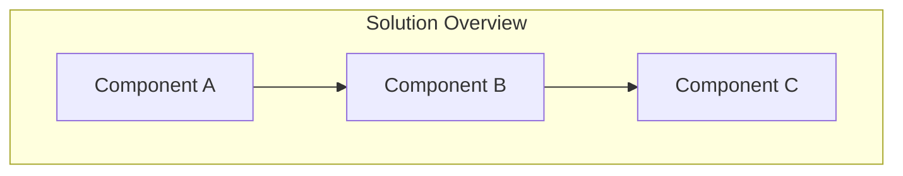
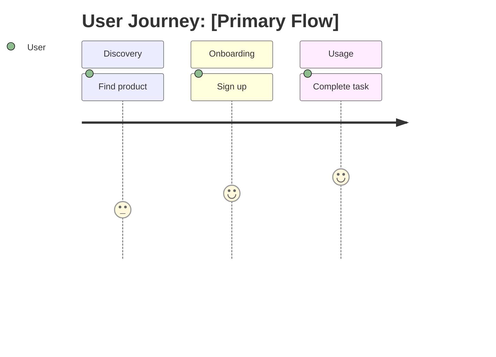

Create a comprehensive Product Requirements Document (PRD) from a product description
or feature idea. Delegates to @product-manager for user analysis, acceptance criteria
definition, and structured requirements documentation.

**ULTRATHINK**: This is a complex document creation task requiring deep analysis of
user needs, business requirements, and acceptance criteria. Take time to thoroughly
analyze before generating content.

## User Input

```text
$ARGUMENTS
```

If no arguments provided, conduct a user interview to gather product description.

---

## Agent Delegation

This command delegates to **@product-manager** from the vendored `.claude/agents/` directory.
The product-manager specializes in PRD creation, user research, and requirements definition.

---

## PRD Document Structure

The generated PRD MUST follow this exact structure. All sections are required unless marked (optional).

### Document Header

```markdown
# PRD: [Product/Feature Name]

**Version**: 1.0.0
**Status**: Draft | In Review | Approved
**Created**: [Date]
**Last Updated**: [Date]
**Author**: @product-manager
**Stakeholders**: [List key stakeholders]

---
```

### Section 1: Changelog

Track all significant changes to this PRD. Add entries as refinements occur.

```markdown
## Changelog

| Version | Date | Changes | Author |
|---------|------|---------|--------|
| 1.0.0 | [Date] | Initial PRD creation | @product-manager |
```

### Section 2: Product Summary

```markdown
## 1. Product Summary

### 1.1 Problem Statement
[Clear description of the problem being solved]

### 1.2 Proposed Solution
[High-level description of the solution]

### 1.3 Value Proposition
[Why this matters - business value, user value]

### 1.4 Key Differentiators (optional)
[What makes this approach unique]

### 1.5 Solution Architecture

**REQUIRED**: Include at least one Mermaid diagram showing the solution at a high level.
Do NOT use ASCII art. Use Mermaid syntax only.


```

### Section 3: User Analysis

```markdown
## 2. User Analysis

### 2.1 Target Users
| User Type | Description | Primary Need |
|-----------|-------------|--------------|
| [Type 1] | [Description] | [Need] |

### 2.2 User Personas

For each primary user type, create a detailed persona:

**Persona: [Name]**
- **Role**: [Job title/role]
- **Goals**: [What they want to achieve]
- **Pain Points**: [Current frustrations]
- **Technical Proficiency**: [Low/Medium/High]

### 2.3 User Journey

**REQUIRED**: Include a Mermaid diagram showing the primary user journey.


```

### Section 4: Goals and Non-Goals

**IMPORTANT**: Non-goals are referenced by `/implement-trd` to prevent scope creep.
Be explicit and specific - vague non-goals are not actionable.

```markdown
## 3. Goals and Non-Goals

### 3.1 Goals

| ID | Goal | Success Metric | Priority |
|----|------|----------------|----------|
| G1 | [Goal description] | [Measurable metric] | P0 |
| G2 | [Goal description] | [Measurable metric] | P0 |
| G3 | [Goal description] | [Measurable metric] | P1 |

### 3.2 Non-Goals (Explicit Scope Exclusions)

These items are **explicitly out of scope** for this PRD. Implementation agents
will reference this list to reject scope creep.

| ID | Non-Goal | Rationale |
|----|----------|-----------|
| NG1 | [What we will NOT do] | [Why it's excluded] |
| NG2 | [What we will NOT do] | [Why it's excluded] |
```

### Section 5: Feature Requirements

Organize features by priority. Use P0/P1/P2 classification:
- **P0**: Must have for MVP / initial release
- **P1**: Should have for complete solution
- **P2**: Nice to have / future enhancement

```markdown
## 4. Feature Requirements

### 4.1 P0 - Core Features (Must Have)

#### F1: [Feature Name]
**Priority**: P0
**Description**: [What this feature does]

**User Stories**:
- As a [user], I want to [action] so that [benefit]

**Acceptance Criteria**:
- [ ] AC-F1.1: [Criterion 1]
- [ ] AC-F1.2: [Criterion 2]

**Dependencies**: [Other features or systems this depends on]

#### F2: [Feature Name]
...

### 4.2 P1 - Enhanced Features (Should Have)

#### F3: [Feature Name]
**Priority**: P1
...

### 4.3 P2 - Future Features (Nice to Have) (optional)

#### F4: [Feature Name]
**Priority**: P2
...
```

### Section 6: Technical Requirements

```markdown
## 5. Technical Requirements

### 5.1 Performance Requirements
| Metric | Target | Measurement |
|--------|--------|-------------|
| [e.g., Response time] | [e.g., < 200ms] | [How measured] |

### 5.2 Security Requirements
- [Requirement 1]
- [Requirement 2]

### 5.3 Accessibility Requirements
- WCAG 2.1 AA compliance (if applicable)
- [Other requirements]

### 5.4 Scalability Requirements (optional)
- [Requirement]

### 5.5 Integration Requirements (optional)
| System | Integration Type | Notes |
|--------|-----------------|-------|
| [System] | [API/Event/etc] | [Notes] |
```

### Section 7: Acceptance Criteria Summary

Consolidate all acceptance criteria for easy reference during implementation.

```markdown
## 6. Acceptance Criteria Summary

### Feature Acceptance Criteria

| ID | Feature | Criterion | Verification Method |
|----|---------|-----------|---------------------|
| AC-F1.1 | F1 | [Criterion] | [Unit test / E2E / Manual] |
| AC-F1.2 | F1 | [Criterion] | [Unit test / E2E / Manual] |
| AC-F2.1 | F2 | [Criterion] | [Unit test / E2E / Manual] |

### Technical Acceptance Criteria

| ID | Requirement | Criterion | Verification Method |
|----|-------------|-----------|---------------------|
| AC-T1 | Performance | [Criterion] | [Load test / Benchmark] |
| AC-T2 | Security | [Criterion] | [Security scan / Audit] |
```

### Section 8: Risk Assessment

**IMPORTANT**: Risks are referenced by `/implement-trd` for contingency planning.

```markdown
## 7. Risk Assessment

| ID | Risk | Likelihood | Impact | Mitigation Strategy |
|----|------|------------|--------|---------------------|
| R1 | [Risk description] | High/Med/Low | High/Med/Low | [How to mitigate] |
| R2 | [Risk description] | High/Med/Low | High/Med/Low | [How to mitigate] |

### Contingency Plans

For high-impact risks, document specific contingency plans:

**R1 Contingency**: [What to do if this risk materializes]
```

### Section 9: Appendices (optional)

Use appendices for reference material that doesn't fit in main sections.

```markdown
## Appendices

### Appendix A: Glossary (optional)
| Term | Definition |
|------|------------|
| [Term] | [Definition] |

### Appendix B: Related Documents (optional)
- [Link to related PRD]
- [Link to technical spec]

### Appendix C: Open Questions (optional)
| Question | Status | Resolution |
|----------|--------|------------|
| [Question] | Open/Resolved | [Answer if resolved] |
```

---

## Diagram Requirements

**MANDATORY**: Use Mermaid syntax for all diagrams. Do NOT use ASCII art.

Acceptable diagram types:
- `graph TB/LR` - Flowcharts and architecture
- `sequenceDiagram` - Interaction flows
- `journey` - User journeys
- `erDiagram` - Data relationships
- `stateDiagram-v2` - State machines

Minimum required diagrams:
1. **Solution Architecture** (Section 1.5) - High-level solution overview
2. **User Journey** (Section 2.3) - Primary user flow

---

## Output Management

### File Location
Save to `docs/PRD/<feature-name>.md`

Use lowercase, hyphenated names:
- `docs/PRD/user-authentication.md`
- `docs/PRD/checkout-flow.md`

### State Update
Update `.trd-state/current.json`:
```json
{
  "prd": "docs/PRD/<feature-name>.md",
  "trd": null,
  "status": "prd-created",
  "branch": null
}
```

### Validation Checklist

Before completing, verify:
- [ ] All required sections present
- [ ] At least 2 Mermaid diagrams included (no ASCII art)
- [ ] All features have acceptance criteria
- [ ] Non-goals are specific and actionable
- [ ] Risks have mitigation strategies
- [ ] Priority labels (P0/P1/P2) assigned to all features

---

## Usage

```
/create-prd <product description or feature idea>
```

### Examples

```
/create-prd User authentication with OAuth2 support
/create-prd E-commerce checkout flow with payment integration
/create-prd Real-time notification system for mobile app
```

---

## Handoff

After PRD creation:
1. Review with stakeholders
2. Use `/refine-prd` for iterations
3. When approved, use `/create-trd` to generate technical requirements

The TRD will reference:
- Goals for success criteria
- Non-goals for scope boundaries
- Risks for contingency planning
- Acceptance criteria for test generation
