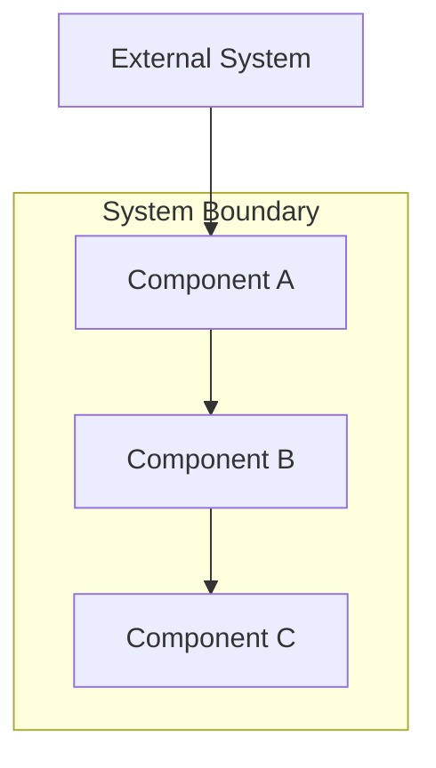
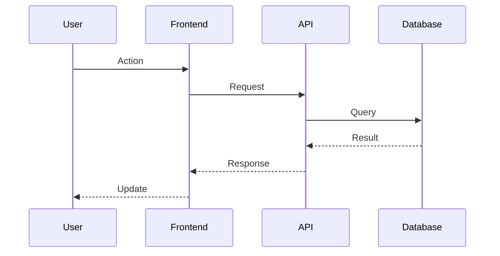
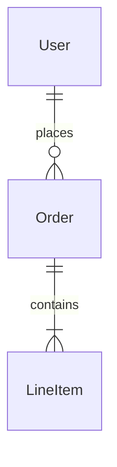

This command takes a comprehensive Product Requirements Document (PRD) and creates a
Technical Requirements Document (TRD) with architecture design, task breakdown, and
execution plan. Delegates to @technical-architect for technical planning.

**ULTRATHINK**: This is a complex technical planning task requiring deep analysis of
requirements, architecture decisions, and implementation strategy. Take time to
thoroughly evaluate technical approaches before generating the TRD.

## User Input

```text
$ARGUMENTS
```

If no path provided, resolve from `.trd-state/current.json` field `prd`.
Error if neither available.

---

## Agent Delegation

This command delegates to **@technical-architect** from the vendored `.claude/agents/` directory.
The technical-architect specializes in TRD creation, architecture design, and implementation planning.

---

## Plan Mode

The TRD operates in **plan mode** - it generates an execution plan but does NOT execute
implementation.

**IMPORTANT**: Execution plans contain NO timing estimates or duration predictions.
Plans organize work by logical dependencies, not calendar time.

---

## PRD Import Requirements

When creating the TRD, import and reference these PRD sections:

| PRD Section | TRD Usage |
|-------------|-----------|
| **Non-Goals** | Copy to TRD; implementation agents check against these for scope creep |
| **Risks** | Incorporate into Risk Assessment with technical mitigations |
| **Acceptance Criteria** | Map to test requirements and verification tasks |
| **Goals** | Define success criteria for implementation |

---

## TRD Document Structure

The generated TRD MUST follow this exact structure. All sections are required unless marked (optional).

### Document Header

```markdown
# TRD: [Product/Feature Name]

**Version**: 1.0.0
**Status**: Draft | In Review | Approved
**Created**: [Date]
**Last Updated**: [Date]
**Author**: @technical-architect
**Source PRD**: [Link to PRD file]
**Task ID Prefix**: [PREFIX] (e.g., AUTH, CHECKOUT, NOTIFY)

---
```

### Section 1: Changelog

```markdown
## Changelog

| Version | Date | Changes | Author |
|---------|------|---------|--------|
| 1.0.0 | [Date] | Initial TRD creation | @technical-architect |
```

### Section 2: Overview

```markdown
## 1. Overview

### 1.1 Technical Summary
[Brief description of the technical approach and key architectural decisions]

### 1.2 Key Technical Decisions

| Decision | Choice | Rationale | Alternatives Considered |
|----------|--------|-----------|------------------------|
| [Decision area] | [What was chosen] | [Why] | [What else was considered] |

### 1.3 Technology Stack

| Layer | Technology | Purpose | Notes |
|-------|------------|---------|-------|
| Frontend | [e.g., React] | [Purpose] | [Version, etc.] |
| Backend | [e.g., Node.js] | [Purpose] | |
| Database | [e.g., PostgreSQL] | [Purpose] | |

### 1.4 Integration Points

| System | Type | Direction | Notes |
|--------|------|-----------|-------|
| [External system] | [REST/GraphQL/Event] | [In/Out/Both] | [Notes] |
```

### Section 3: System Architecture

**REQUIRED**: Include Mermaid diagrams. Do NOT use ASCII art.

```markdown
## 2. System Architecture

### 2.1 Architecture Overview

**REQUIRED**: High-level architecture diagram



### 2.2 Component Architecture

#### 2.2.1 [Component Name]
**Responsibility**: [What this component does]
**Interfaces**: [APIs, events, etc.]
**Dependencies**: [What it depends on]

### 2.3 Data Flow

**REQUIRED**: Data flow diagram



### 2.4 State Management (if applicable)

[Description of state management approach]
```

### Section 4: Technical Specifications

Detail the technical implementation for each major component.

```markdown
## 3. Technical Specifications

### 3.1 [Component/Feature Name]

**Purpose**: [What this does]

**Interface**:
```typescript
// API contract or interface definition
interface Example {
  field: Type;
}
```

**Behavior**:
- [Behavior 1]
- [Behavior 2]

**Error Handling**:
- [Error case]: [How handled]

### 3.2 [Next Component]
...
```

### Section 5: Master Task List

**CRITICAL**: Task ID Convention for unique identification across project.

```markdown
## 4. Master Task List

### 4.1 Task ID Convention

Task IDs follow the format: `[PREFIX]-[CATEGORY][SEQ]`

- **PREFIX**: Unique identifier for this TRD (from header, e.g., AUTH, CHECKOUT)
- **CATEGORY**: Single letter indicating task type
  - `P` = Plugin/Infrastructure setup
  - `F` = Frontend implementation
  - `B` = Backend implementation
  - `T` = Testing
  - `D` = Documentation
  - `I` = Integration
- **SEQ**: Three-digit sequence number (001, 002, etc.)

Examples:
- `AUTH-B001` = Authentication TRD, Backend task 1
- `AUTH-F001` = Authentication TRD, Frontend task 1
- `CHECKOUT-T001` = Checkout TRD, Test task 1

### 4.2 Phase 1: [Phase Name]

| Task ID | Description | Dependencies | Acceptance Criteria |
|---------|-------------|--------------|---------------------|
| [PREFIX]-P001 | [Task description] | None | [Criteria] |
| [PREFIX]-P002 | [Task description] | [PREFIX]-P001 | [Criteria] |

### 4.3 Phase 2: [Phase Name]

| Task ID | Description | Dependencies | Acceptance Criteria |
|---------|-------------|--------------|---------------------|
| [PREFIX]-B001 | [Task description] | [PREFIX]-P002 | [Criteria] |
| [PREFIX]-F001 | [Task description] | [PREFIX]-B001 (API contract only) | [Criteria] |

### 4.4 Phase 3: [Phase Name]
...
```

### Section 6: Execution Plan

**CRITICAL**: Phasing and parallelization are essential for efficient implementation.

```markdown
## 5. Execution Plan

### 5.1 Phase Overview

| Phase | Focus | Prerequisites | Parallelizable Sessions |
|-------|-------|---------------|------------------------|
| 1 | Foundation | None | 1A, 1B can run in parallel |
| 2 | Implementation | Phase 1 complete | 2A, 2B can run in parallel after API contract |
| 3 | Integration | Phase 2 complete | 3A, 3B can run in parallel |

### 5.2 Session Details

#### Phase 1: Foundation

**Session 1A: [Session Name]**
- Tasks: [PREFIX]-P001, [PREFIX]-P002
- Agent: @backend-implementer
- Can parallelize with: Session 1B

**Session 1B: [Session Name]**
- Tasks: [PREFIX]-P003, [PREFIX]-P004
- Agent: @frontend-implementer
- Can parallelize with: Session 1A

#### Phase 2: Implementation

**Session 2A: [Session Name]**
- Tasks: [PREFIX]-B001, [PREFIX]-B002
- Agent: @backend-implementer
- Blocked by: Session 1A

**Session 2B: [Session Name]**
- Tasks: [PREFIX]-F001, [PREFIX]-F002
- Agent: @frontend-implementer
- Blocked by: API contract from 2A (not full completion)
- Can parallelize with: Session 2A (after contract)

### 5.3 Parallelization Map

**REQUIRED**: Mermaid diagram showing parallel execution opportunities

```mermaid
gantt
    title Execution Plan (No time scale - dependency order only)
    dateFormat X
    axisFormat %s

    section Phase 1
    Session 1A: p1a, 0, 1
    Session 1B: p1b, 0, 1

    section Phase 2
    Session 2A: p2a, after p1a, 1
    Session 2B: p2b, after p1a, 1

    section Phase 3
    Session 3A: p3a, after p2a p2b, 1
```



### 5.4 Critical Path

The critical path is: [List the blocking sequence of tasks]

### 5.5 Offload Recommendations (optional)

Tasks that could be delegated to specialized agents:

| Task | Recommended Agent | Rationale |
|------|-------------------|-----------|
| [Task ID] | @[agent] | [Why] |
```

### Section 7: Quality Requirements

```markdown
## 6. Quality Requirements

### 6.1 Testing Requirements

| Type | Coverage Target | Scope |
|------|-----------------|-------|
| Unit Tests | ≥80% | All business logic |
| Integration Tests | ≥70% | API endpoints, data flows |
| E2E Tests | Critical paths | User journeys from PRD |

### 6.2 Code Quality Standards

- [Standard 1]
- [Standard 2]

### 6.3 Security Requirements

- [ ] [Requirement 1]
- [ ] [Requirement 2]

### 6.4 Performance Requirements

| Metric | Target | Measurement Method |
|--------|--------|-------------------|
| [Metric] | [Target] | [How measured] |
```

### Section 8: Risk Assessment

**IMPORTANT**: Import risks from PRD and add technical risks.
These are referenced by `/implement-trd` for contingency planning.

```markdown
## 7. Risk Assessment

### 7.1 Risks Imported from PRD

| PRD Risk ID | Risk | Technical Mitigation |
|-------------|------|---------------------|
| R1 | [From PRD] | [Technical approach to mitigate] |

### 7.2 Technical Risks

| ID | Risk | Likelihood | Impact | Mitigation |
|----|------|------------|--------|------------|
| TR1 | [Technical risk] | High/Med/Low | High/Med/Low | [Mitigation] |

### 7.3 Implementation Risks

| ID | Risk | Likelihood | Impact | Mitigation |
|----|------|------------|--------|------------|
| IR1 | [Implementation risk] | High/Med/Low | High/Med/Low | [Mitigation] |

### 7.4 Contingency Plans

For high-impact risks, document specific responses:

**TR1 Contingency**: [What to do if risk materializes]
```

### Section 9: Non-Goals (Imported from PRD)

**IMPORTANT**: Copy from PRD. Implementation agents check against these.

```markdown
## 8. Non-Goals (Scope Boundaries)

The following are **explicitly out of scope** per the PRD. Implementation agents
MUST reject requests that fall into these categories.

| PRD ID | Non-Goal | Rationale |
|--------|----------|-----------|
| NG1 | [From PRD] | [From PRD] |
| NG2 | [From PRD] | [From PRD] |
```

### Section 10: Appendices (optional)

```markdown
## Appendices

### Appendix A: File Structure (optional)
```
project/
├── src/
│   ├── components/
│   └── ...
```

### Appendix B: Database Schema (optional)



### Appendix C: API Contracts (optional)

[OpenAPI spec or interface definitions]

### Appendix D: Glossary (optional)

| Term | Definition |
|------|------------|
| [Term] | [Definition] |
```

---

## Diagram Requirements

**MANDATORY**: Use Mermaid syntax for all diagrams. Do NOT use ASCII art.

Minimum required diagrams:
1. **Architecture Overview** (Section 2.1)
2. **Data Flow** (Section 2.3)
3. **Execution Plan** (Section 5.3)

---

## Output Management

### File Location
Save to `docs/TRD/<feature-name>.md`

### State Update
Update `.trd-state/current.json`:
```json
{
  "prd": "docs/PRD/<feature-name>.md",
  "trd": "docs/TRD/<feature-name>.md",
  "status": "trd-created",
  "branch": null
}
```

### Validation Checklist

Before completing, verify:
- [ ] Task ID prefix is unique within project
- [ ] All tasks have unique IDs following convention
- [ ] At least 3 Mermaid diagrams included (no ASCII art)
- [ ] All tasks have dependencies documented
- [ ] Parallelization opportunities identified
- [ ] Non-goals imported from PRD
- [ ] Risks imported and technical mitigations added
- [ ] No timing estimates in execution plan

---

## Usage

```
/create-trd [path-to-prd]
```

Path is optional if `.trd-state/current.json` has PRD reference.

### Examples

```
/create-trd docs/PRD/user-authentication.md
/create-trd docs/PRD/checkout-flow.md
/create-trd   # Uses current.json
```

---

## Handoff

After TRD creation:
1. Review TRD with stakeholders
2. Use `/refine-trd` for adjustments if needed
3. Use `/implement-trd` to begin execution

The implementation phase:
- Uses execution plan for phasing and parallelization
- Checks non-goals to prevent scope creep
- References risks for contingency handling
- Tracks progress in `.trd-state/`
